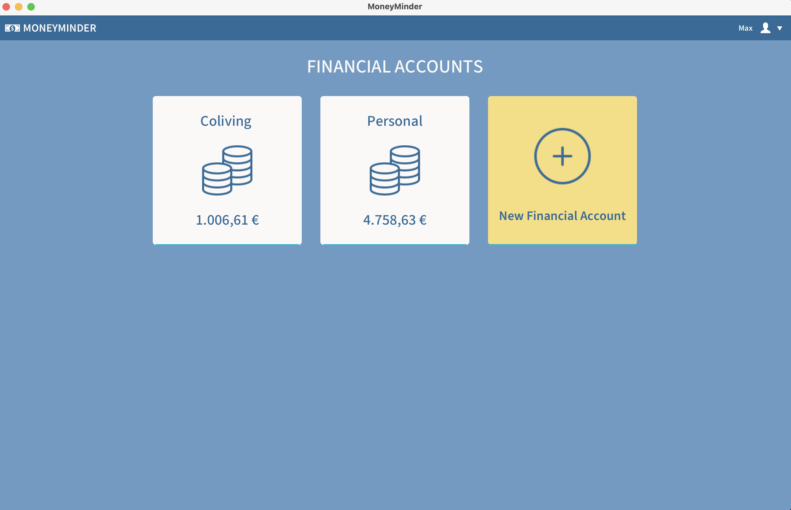
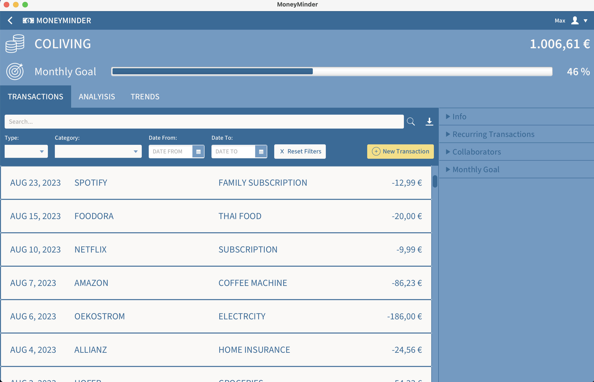
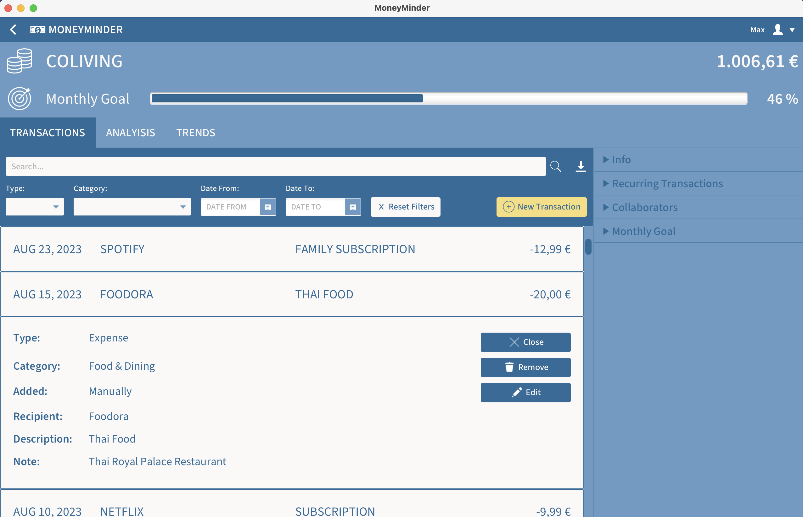
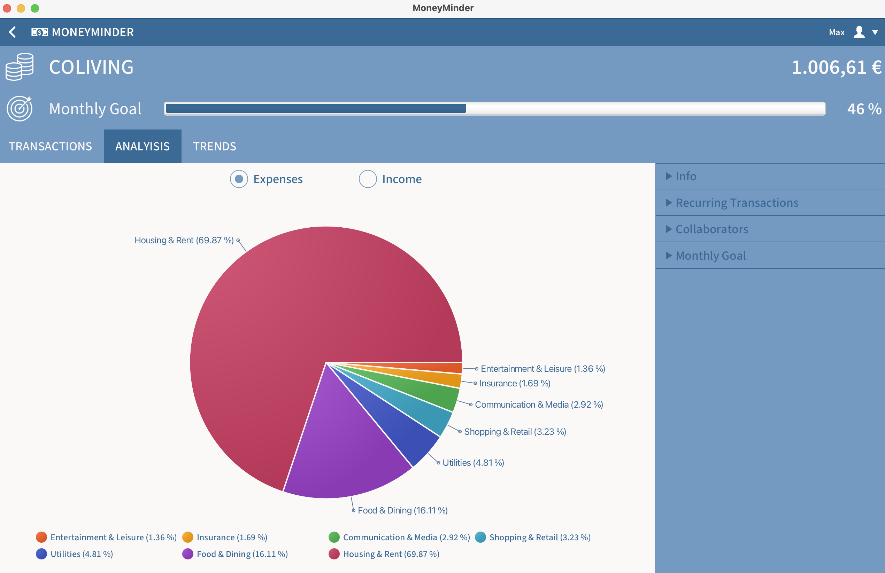
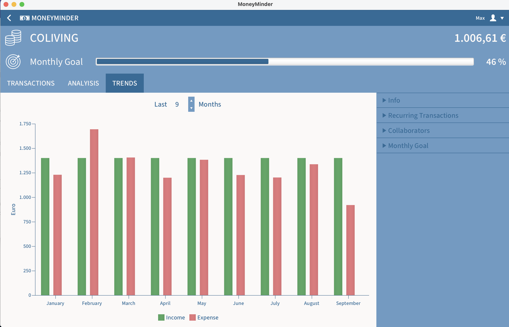
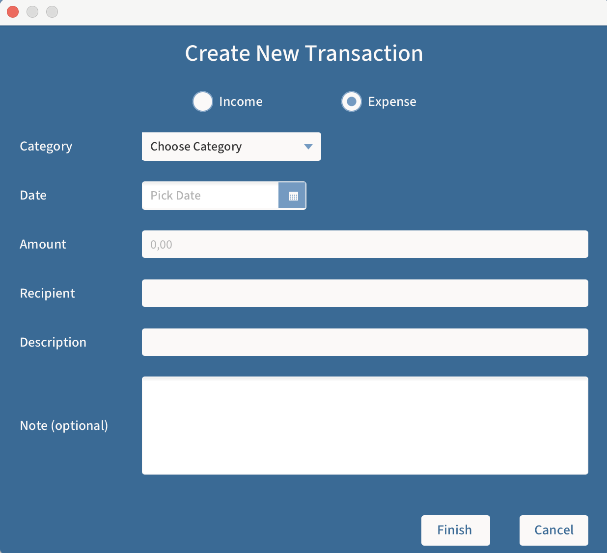

# MoneyMinder

 

    

 

MoneyMinder is a desktop application for managing personal finances.
It helps users categorize and visualize their income and expenses, providing an overview of their cash flow.
With search and filter functions, finding specific transactions is easy. It automatically adds recurring expenses and
allows users to set financial goals.
Multiple finance accounts can be created and shared with others, making it suitable for shared households.

 

    

 

    

 

    

 

    

 

    

 

    

 

    

 

    

